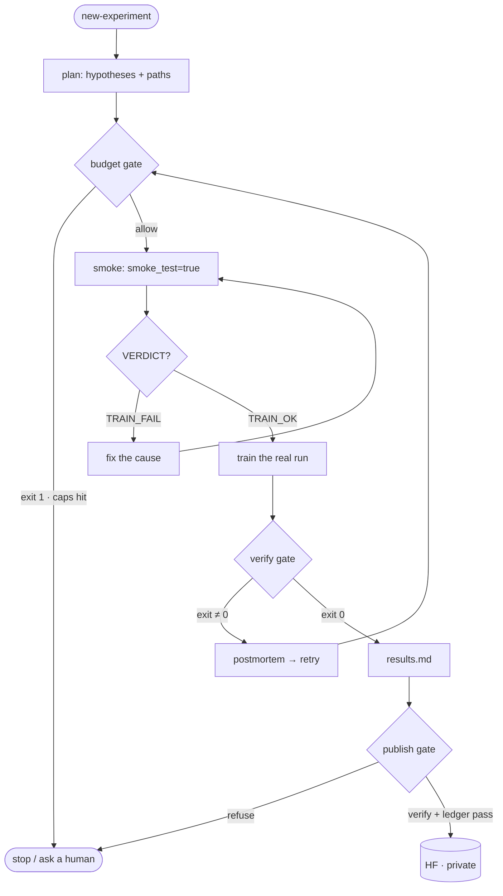

# my-little-ml-intern

|            |                                                                                                                                                                                                                                            |
| ---------- | ------------------------------------------------------------------------------------------------------------------------------------------------------------------------------------------------------------------------------------------ |
| CI/Testing | [](https://github.com/kryvokhyzha/my-little-ml-intern/actions/workflows/ci.yml)                                                                 |
| Package    | [](https://www.python.org/downloads/release/python-3130/)                                                                                                                       |
| Meta       | [](https://github.com/astral-sh/ruff) [](LICENSE) |

> [!NOTE]
> **This is a template / reference repository.** It ships one worked example
> (`001-pi-mono-sft`) and a full set of gates so you can see the loop end-to-end,
> then make it yours. Two ways to adopt it:
>
> - **Fork it** as the starting point for your own experiments — replace the
>   `<!-- template: … -->` sections below, drop in your `configs/`, and go.
> - **Vendor the pack** into an existing project — copy `.claude/skills/` and
>   `src/intern/` (see [Vendoring into your project](#-vendoring-into-your-project)).
>
> Nothing here is specific to the example beyond `configs/`, `scripts/python/NNN-*.py`,
> and `experiments/`. The skills and enforcement library are project-agnostic.

## 📖 About

<!-- template: replace with your project description -->

A personal "ML intern" for working on ML/LLM projects with Claude Code (and other AI agents):

- **Skill pack** (`.claude/skills/`) — experiment scaffolding, training discipline (preflight,
  smoke gates, OOM ladders), verification, tracking, literature research, publishing.
- **Enforcement library** (`src/intern/`) — the guardrails are code, not prose: verification,
  budget, and dependency-age gates exit nonzero and block the workflow.
- **Training lanes** (`src/training/`) — Hydra configs mapped onto TRL (SFT/DPO), PyTorch
  Lightning, and axolotl (rendered YAML for remote GPU boxes).

## 🔁 The loop

The gates are the point: every transition below is enforced by an exit code, not
by convention. Denials loop back — they don't wave you through.



Each gate, in words:

- **budget gate** — `intern.py budget can-launch` exits 1 → no new path (caps on paths,
  retries, GPU-hours, parameter ceiling).
- **smoke** — every run starts with `smoke_test=true` and must print `VERDICT: TRAIN_OK`
  before any long run.
- **verify gate** — `intern.py verify` must exit 0; writing `results.md` is forbidden
  otherwise. A low loss number is never evidence the model works.
- **publish gate** — `intern.py publish` re-runs verify and refuses without `results.md`
  plus a ledger row with `status=passed` and `verify=pass`.

## 🚀 Quick Start

### Prerequisites

> [!IMPORTANT]
> - Python 3.13
> - `uv` package manager
>   ([installation guide](https://docs.astral.sh/uv/getting-started/installation/))
> - Hugging Face account with API token for model access

### Running an Experiment

One experiment number = three artifacts: `scripts/python/NNN-<slug>.py`,
`configs/NNN-<slug>.yaml`, `experiments/NNN-<slug>/`.

```bash
# 1. Smoke run first (mandatory) — must print "VERDICT: TRAIN_OK"
uv run python scripts/python/000-tiny-sft-smoke.py smoke_test=true

# 2. Real run
uv run python scripts/python/000-tiny-sft-smoke.py

# 3. Blocking verification gate — results are invalid unless this exits 0
uv run python scripts/python/intern.py verify --experiment 001

# Gates dashboard (verify + budget + ledger), and the individual gates
uv run python scripts/python/intern.py status --experiment 001
uv run python scripts/python/intern.py budget --experiment 001 status
uv run python scripts/python/intern.py ledger --experiment 001 show
uv run python scripts/python/intern.py deps
```

Model, dataset, training lane, tracker, and compute target are Hydra groups — override per run:

```bash
uv run python scripts/python/001-pi-mono-sft.py model=gemma_4_e2b_it data=pi_mono_sft
uv run python scripts/python/000-tiny-sft-smoke.py trainer=trl_dpo tracking=wandb compute=ssh
```

## 🧰 Skills

Source of truth: [`.claude/skills/`](.claude/skills/) (auto-discovered by Claude Code).

| Skill                          | Purpose                                                             |
| ------------------------------ | ------------------------------------------------------------------- |
| `new-experiment`             | Scaffold the numbered triple + task/plan/budget/ledger skeletons    |
| `train-llm`                  | Lane choice, preflight, smoke gate, launch, OOM recovery            |
| `verify-run`                 | Blocking verification gate after ANY training run                   |
| `track-experiments`          | Tracking setup, reading metrics/alerts, alert→override iteration   |
| `literature-recipe-research` | Ranked recipe table with verified datasets before planning          |
| `autoresearch-loop`          | Autonomous hypothesis→train→verify iteration under the budget     |
| `publish-model`              | Verify-gated upload of model + reproducibility bundle to the HF Hub |
| `new-doc`                    | New numbered doc under`docs/`                                     |
| `new-script`                 | New non-experiment script + paired Hydra config                     |

## 📦 Vendoring into your project

Copy into any repo built from `llm-python-template`:

1. `.claude/skills/` — the skill pack
2. `src/intern/` — the enforcement library (plus the `src/helper/display` improvements)
3. `scripts/python/intern.py` and `scripts/bash/` (notify.sh, gpu_probe.sh)
4. `configs/` groups: `model/`, `data/`, `trainer/`, `tracking/`, `compute/`, `budget/`
5. the `deps-age` hook from `.pre-commit-config.yaml`

Then run `uv run pytest` to confirm the gates work in place.

## 🔔 Notifications

`scripts/bash/notify.sh <event> "<msg>" [experiment]` pings Telegram/Slack on
milestones (plan ready, train started/done, blockers, approvals) with a
formatted card — event emoji + label, project + experiment, your message, and a
"next step" hint. Set the `TG_*` / `SLACK_*` vars from
[.env.example](.env.example); unset channels are silent no-ops. Preview any
message without sending: `NOTIFY_DRY_RUN=1 scripts/bash/notify.sh train_done "…"`.

## ⚙️ Development Environment Setup

> [!WARNING]
> This project is based on `Python 3.13` and uses `uv` for dependency management.

1. Clone the repository and `cd` into it.
2. Install `uv` following the
   [official documentation](https://docs.astral.sh/uv/getting-started/installation/).
3. Create a virtual environment:

   ```bash
   make uv_create_venv
   ```
4. Install dependencies:

   ```bash
   make uv_install_deps
   ```
5. Copy `.env.example` to `.env` and fill in tokens (`HF_TOKEN`, optional
   `WANDB_API_KEY`, notification tokens).
6. Install pre-commit hooks:

   ```bash
   make pre_commit_install
   ```

## 🤝 Contributing

- Conventions and agent guidance: [AGENTS.md](AGENTS.md) (imported by `CLAUDE.md`).
- Architecture contract: [docs/001-architecture.md](docs/001-architecture.md) — change the
  doc first, then the code.
- Verify before declaring done: `uv run pytest`, `make pre_commit_run`.
