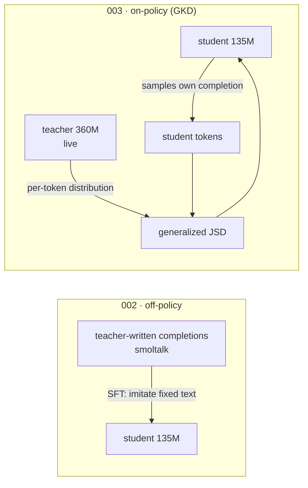
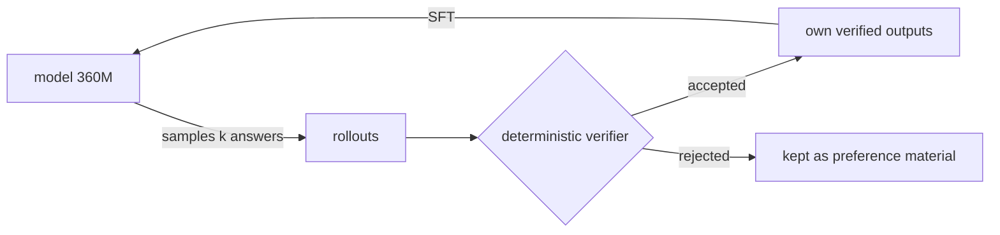

# 008 — Examples: off-policy, on-policy, and self-distillation

<!-- Walkthrough of experiments 002/003 — the controlled off- vs on-policy distillation
pair. Lane API in docs/001 ("run_gkd"); mode choice guidance in the distill-traces skill.
Inspired by burtenshaw/training-agents (agentic-self-distillation) and GKD
(Agarwal et al., 2023, arXiv:2306.13649). -->

Two ways to pour a teacher into a smaller student:

|                                   | **002-distill-off-policy**                       | **003-distill-on-policy**                                      |
| --------------------------------- | ------------------------------------------------ | -------------------------------------------------------------- |
| Method                            | plain SFT on teacher-written data                | GKD (`trainer=trl_gkd`)                                        |
| Who writes the training sequences | the teacher (fixed dataset)                      | the **student samples** (lmbda of steps)                       |
| Teacher at training time          | absent — it authored the data offline            | **live** (`model.teacher`), grades token-level                 |
| Loss                              | cross-entropy on the whole rendered conversation | generalized JSD vs teacher distribution (final assistant turn) |
| Cost                              | 1 model resident, no generation                  | 2 models resident + in-loop generation                         |
| Failure mode addressed            | —                                                | exposure bias (train/inference mismatch)                       |

The pair is deliberately controlled: **same student**
(`HuggingFaceTB/SmolLM2-135M-Instruct`), **same dataset**
(`HuggingFaceTB/smoltalk` everyday-conversations — itself distilled data, so its
completions ARE teacher outputs), **same step budget**. The distillation method
is the near-single variable, per the one-variable-per-path rule — with one
honest confound the configs cannot remove: 002's unmasked SFT supervises the
whole conversation while GKD supervises only the final assistant turn
(`assistant_only_loss` hard-fails on SmolLM2's chat template; see 002's
plan.md).



## Run either

```bash
# off-policy (SFT imitation):
uv run python scripts/python/002-distill-off-policy.py smoke_test=true   # VERDICT: TRAIN_OK
uv run python scripts/python/002-distill-off-policy.py

# on-policy (GKD; downloads the 360M teacher too):
uv run python scripts/python/003-distill-on-policy.py smoke_test=true    # VERDICT: TRAIN_OK
uv run python scripts/python/003-distill-on-policy.py
```

Both smoke on CPU/MPS; the real 300-step runs want a small GPU (003 is
generation-bound: `lmbda=0.5` of its steps sample up to `max_new_tokens=128`
from the student).

## The knobs that define GKD (`configs/trainer/trl_gkd.yaml`)

- `lmbda` — WHO writes each step's training sequences. Per step, with
  probability `lmbda` the **student samples** the completion (on-policy);
  otherwise the step uses the **dataset text** (off-policy). `1.0` = fully
  on-policy; `0.0` = supervised KD on the corpus; `0.5` = the paper's mix.
- `beta` — WHAT divergence grades them: the generalized-JSD interpolation
  between teacher (P) and student (Q). `0.0` = forward KL `KL(P‖Q)`
  (mass-covering — the student must put mass everywhere the teacher does; a
  small student ends up over-smoothed); `1.0` = reverse KL `KL(Q‖P)`
  (mode-seeking — the student commits to the teacher modes it can actually fit;
  the usual pick when student ≪ teacher); `0.5` = symmetric middle.
- `seq_kd` — a third data source: the **teacher generates** the targets at
  training time (sequence-level KD), instead of the dataset authors.
- `model.teacher` — a plain model-group node; teacher and student **must share a
  tokenizer** (per-token distributions must align). The SmolLM2 family
  (135M/360M/1.7B) is the cheapest such ladder.

**Is GKD at `lmbda=0` the same as SFT on that dataset? No — same sequences,
different target.** SFT trains hard-label cross-entropy against the dataset's
one-hot tokens and needs no teacher at all (that's 002). GKD at `lmbda=0` still
loads the live teacher and matches the student to the teacher's **full per-token
distribution** over those same sequences — soft labels / dark knowledge, classic
Hinton-style KD on a corpus. So the GKD lane covers both settings: `lmbda=0` =
off-policy **distillation** (soft labels), `lmbda>0` = on-policy; plain
off-policy **imitation** (hard labels, teacherless) stays the `trl_sft` lane.

## The third mode: self-distillation (004-self-distill)

No external teacher at all — the model is its own: **004-self-distill**
(STaR/RFT) has `SmolLM2-360M-Instruct` sample k=4 answers per verifiable train
task (2-digit addition), a **deterministic verifier** accept the correct ones,
and the SAME model fine-tune on its own accepted rollouts. The claim metric is
the held-out **task success rate** (same verifier, greedy), not the loss.



```bash
uv run python scripts/python/prep-self-distill.py        # rollouts + verify + dataset + baseline
uv run python scripts/python/004-self-distill.py smoke_test=true
uv run python scripts/python/004-self-distill.py
uv run python scripts/python/prep-self-distill.py eval_model_path=experiments/004-self-distill/ckpts/checkpoint-100
```

This is the distill-traces skill's loop end-to-end on the smallest honest task
(`intern.traces.TraceStore`, split-before-collect, verification-first
acceptance) — swap the arithmetic pool for real agent tasks and the same
machinery carries over.

## The TRL distillation landscape (1.7.1)

What TRL itself offers, mapped to this repo. Everything below the stable line
lives in `trl.experimental` — a lane for any of them is a one-file
`configs/trainer/<name>.yaml` addition (the `args._target_` pattern) plus a
`run_*` entry, added when an experiment actually needs it, not before.

| TRL module                                    | Method (paper)                                                                                             | Teacher?                         | Our coverage                                                                                   |
| --------------------------------------------- | ---------------------------------------------------------------------------------------------------------- | -------------------------------- | ---------------------------------------------------------------------------------------------- |
| `SFTTrainer` (stable)                         | off-policy imitation                                                                                       | offline (authored the data)      | `trl_sft` — **002**                                                                            |
| `experimental.gkd`                            | GKD on-policy KD (Agarwal 2023)                                                                            | live, same tokenizer             | `trl_gkd` — **003**                                                                            |
| generate→verify→SFT (no dedicated trainer)    | STaR / rejection-sampling FT                                                                               | none — self                      | `prep-self-distill.py` + `trl_sft` — **004**                                                   |
| `experimental.ssd`                            | Simple Self-Distillation (Zhang 2026): FT on raw UNVERIFIED self-samples                                   | none — self                      | not shipped; 004's verifier-first loop is the stricter cousin                                  |
| `experimental.sdft`                           | Self-Distillation FT (Shenfeld 2026): task-prompted self as teacher, continual learning without forgetting | none — self (prompt-conditioned) | not shipped; candidate lane when continual-learning experiments start                          |
| `experimental.gold`                           | GOLD: on-policy distillation ACROSS tokenizers/model families                                              | live, any tokenizer              | not shipped; the escape hatch when teacher/student vocabularies differ (GKD's hard constraint) |
| `experimental.minillm`                        | MiniLLM: reverse-KL policy-gradient distillation                                                           | live                             | not shipped                                                                                    |
| `experimental.distillation`                   | plain logit distillation (standalone config)                                                               | live                             | not shipped                                                                                    |
| `GRPOTrainer` (stable) + verifier rewards     | RLVR — RL flavor of self-improvement                                                                       | none — reward function           | `trl_grpo` lane                                                                                |
| `experimental.online_dpo` / `nash_md` / `xpo` | self-play preference optimization                                                                          | judge/reward                     | not shipped                                                                                    |

## When teacher and student tokenizers differ

Token-level losses (GKD's JSD, plain logit KD, MiniLLM) require the two
per-token distributions to share a vocabulary and segmentation — different
tokenizers break them. The menu that survives:

- **Text-level distillation — tokenizer-agnostic by construction.** The teacher
  only produces strings, so ANY teacher works, including API-only frontier
  models: off-policy SFT on teacher generations (the `trl_sft` lane — 001 was
  exactly this: agent traces → gemma), verifier-filtered rejection sampling (the
  004 machinery with any generator), preference distillation (teacher
  writes/ranks pairs → `trl_dpo`, or unpaired labels → `trl_kto`), and
  teacher-as-judge rewards (`trl_grpo` — scalar rewards carry no tokenization).
- **GOLD (`trl.experimental.gold`) — distribution-level across tokenizers.**
  Swaps GKD's JSD for **ULD** (Universal Logit Distillation: compare SORTED
  probability vectors — vocabulary-agnostic) with extended alignment that maps
  and merges token probabilities across the two tokenizations of the same text.
  Key knobs: `use_uld_loss: true`, `teacher_tokenizer_name_or_path`,
  `use_extended_uld`, `uld_token_merge_strategy`; optional vLLM-served teacher.
  One-file lane addition when an experiment needs it.
- Outside TRL (research-grade): vocabulary transplantation / token-alignment
  (retokenize the student to the teacher's vocab, then plain GKD) — heavy
  surgery, rarely worth it versus GOLD or text-level.

Rule of thumb: same family → `trl_gkd` (cheapest signal-per-token). Different
open-weights families → GOLD or text-level. API-only teacher → text-level only.

## When to use which (short version)

Start **off-policy** — cheapest, and the distill-traces skill's whole
trace→dataset loop feeds it. Go **on-policy** when the off-policy student shows
exposure-bias symptoms: imitates cleanly on-distribution but collapses on its
own generations. The full decision note lives in the distill-traces skill; the
verify gate treats `trl_gkd` runs as generation tasks (samples required) with
`loss_plausibility` skipped (JSD is not vocab cross-entropy).
