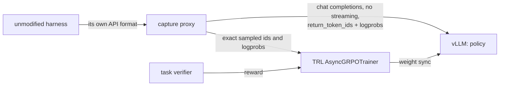

# 011 — Harness RL: train a model inside the agent harness that runs it

<!-- Adoption analysis for loop-owning harness RL (FineEnvs, Hugging Face, 2026)
with TRL and OpenEnv. Written 2026-10-03 against trl 1.14.1 and openenv 0.7.0.
Supersedes the "loop-owning" half of docs/009, whose release blocker is gone. -->

**Verdict.** Train in the one harness that will run the model. A recording proxy
between the unmodified harness and vLLM captures the exact sampled tokens, so
the trainer learns from what the model really produced. This repo now installs
both halves — the capture proxy (openenv 0.7.0) and TRL's harness trainer (trl
1.14.1) — but does not connect them. The released TRL also rebuilds every prompt
by re-tokenization. The exact-token trainer merged on TRL `main` on 2026-10-01
and has no release yet.

## The method

An agent harness (OpenCode, Codex, Claude Code, or a Python framework such as
Google ADK) owns its tool loop. Harness RL leaves that loop untouched:

The OpenEnv capture proxy speaks four API formats (OpenAI Chat Completions,
OpenAI Responses, Anthropic Messages, Gemini) and converts each one to chat
completions for vLLM. It never streams to vLLM, it forces `top_p=1` because the
logprobs are taken after truncation, and it checks each id against its logprob.
A turn that fails the check stays in the context with mask 0 and never becomes a
training target. A LiteLLM `openai/<model>` client reaches the proxy unchanged,
because the proxy passes chat completions through.

## The FineEnvs result, with its limits

The runs used LFM2.5-2.6B, full fine-tuning, 2×H100 (one trains, one serves),
1,000 steps, and 32–46 h each. The reward was correctness × (1 + 0.1·15/(15 +
tool calls)). The tasks were data-analysis questions (SmolDataEnvs), not
software patches.

| Run                                  | Pass@1        |
| ------------------------------------ | ------------- |
| Base, four harnesses                 | 42.2%         |
| RL in all four harnesses             | 54.2%         |
| RL in OpenCode only, scored in it    | 33.6% → 58.0% |
| RL in all four, scored in OpenCode   | 49.6%         |
| SFT on 801 OpenCode teacher rollouts | 47.5%         |
| SFT on all 3,189 teacher rollouts    | 43.1%         |

The same base weights score 62.1% under Mini-SWE-Agent and 33.2% under Claude
Code, so the harness alone moves the score by 29 points. The lesson for one
target harness is the OpenCode row: in-harness training beat cross-harness
training by 8.4 points there. Each run used one seed, and the best checkpoint
was chosen on the test set. Sources: the FineEnvs Space
(huggingface.co/spaces/FineEnvs/multi-harness-rl) and
github.com/adithya-s-k/FineEnvs.

## What TRL and OpenEnv give this repo today

| Piece                                    | Where                         | State                                               |
| ---------------------------------------- | ----------------------------- | --------------------------------------------------- |
| Capture proxy                            | openenv 0.7.0 (`async` group) | `python -m openenv.core.harness.capture.server`     |
| `HarnessRolloutWorker`                   | trl 1.14.1                    | imports; re-tokenizes each prompt                   |
| Validated-capture trainer (TRL PR #6947) | TRL `main`, 2026-10-01        | unreleased; consumes OpenEnv's exact token captures |

In trl 1.14.1, `_turns_from_trace` rebuilds each prompt with
`apply_chat_template(messages, tools=...)`. It passes no `enable_thinking` and
no recorded prompt ids. The completion ids and logprobs come from the capture.
For a model whose template renders past thinking or tool arguments differently
from the sampled text, the rebuilt prompt differs from the one the model saw.
The worker then forks a new training row, and the token cost grows with the
square of the turn count. Measure the clean/fork tally before a long run.

## What this repo lacks

1. **Lane wiring.** `run_async_grpo` in `src/training/trl/run.py` never passes
   `rollout_worker`. `src/training/trl/rewards.py` rejects an empty
   `reward_funcs` unless an environment supplies the reward.
   `configs/trainer/trl_async_grpo.yaml` has no harness node.
2. **Config does not reach an injected worker.** The trainer passes none of its
   settings to a worker built outside it: not `lora_name`, not
   `max_inflight_tasks` (the worker default is 128). Copy each value by hand.
3. **LoRA adapter sync skips the harness.** The session never learns the adapter
   name (`trl-policy-vN`). With `vllm serve --enable-lora`, the agent keeps
   sampling the base model. Use merged weight sync, or make the proxy rewrite
   `model` to the current adapter for each session.
4. **flash-attn3 is forced.** A model with a head dimension above 256 fails at
   the first forward pass (gemma.md has the details for Gemma 4).
5. **No importance-sampling correction.** The only correction is the PPO clip
   against vLLM's logprobs. A rollout model at a different precision from the
   trainer biases that ratio without a warning.
6. **Trainer scale.** FSDP2 only, no DeepSpeed, no context or sequence
   parallelism. A row longer than `token_budget` (default: vLLM's
   `max_model_len`) is dropped.

## Build an environment for a new harness

The trainer needs a picklable `ResourceSessionFactory`. Its
`create(task, seed, episode_id)` returns a session with four methods:
`wait_for_completion`, `fetch_proxy_trace`, `verify`, and `close`. Three
optional hooks shape training:

- `rollout_reward_fn` — turns the verifier outcome into the reward.
- `agent_turn_fn` — drops model calls that are not agent turns. A context
  summarizer or a title generator is a different task; never train on it.
- `train_turn_fn` — narrows the trained turns, for example to turns with a tool
  call.

To adapt a harness:

1. Start vLLM with
   `--return-tokens-as-token-ids --logprobs-mode processed_logprobs`.
2. Start the capture proxy in front of it. Open one proxy session per rollout.
3. Point the harness's OpenAI base URL at the proxy, with the session id as the
   API key.
4. Run the harness on one task. Score the result with the task's own verifier.
5. Read the clean/fork tally on a few real rollouts before any long run.

Start with a binary reward from the verifier. Add the tool-call bonus only after
the binary signal moves.

## What to expect

Measured results for software-engineering agents near 32B:

| Work                         | Method                       | SWE-bench Verified | Compute                   |
| ---------------------------- | ---------------------------- | ------------------ | ------------------------- |
| DeepSWE (Qwen3-32B)          | RL, 200 steps                | 23% → 42.2%        | ~9,200 H100-h             |
| SkyRL SA-SWE-32B (Qwen3-32B) | RL, 125 steps                | 24.4% → 39.4%      | 4,601 H100-h              |
| SERA (Qwen3-32B)             | SFT on a GLM-4.6 teacher     | 24.4% → 49.5%      | 960 H100-h, data included |
| SWE-Lego (Qwen3-32B)         | SFT on a Qwen3-Coder teacher | 23.2% → 52.6%      | ~18k trajectories         |
| SWE-Gym (Qwen2.5-Coder-32B)  | self-RFT, LoRA               | 19.0% → 19.7%      | —                         |
| Nebius (Qwen2.5-72B)         | self-RFT, then RL            | 11% → 20% → 39.0%  | —                         |

Sources: huggingface.co/agentica-org/DeepSWE-Preview, arXiv 2511.16108,
2601.20789, 2601.01426, 2412.21139, 2508.03501.

Three conclusions follow:

- SFT on a strong teacher's trajectories gives the most per GPU-hour. RL costs
  about five times more for a smaller gain at this scale.
- Self-RFT helps when the base model makes format or protocol errors (Nebius: +9
  points, malformed turns masked). It barely helps a model that already follows
  the protocol (SWE-Gym: +0.7 points).
- LoRA for RL matches full fine-tuning at rank 1 on single-turn math up to 8,192
  tokens (thinkingmachines.ai/blog/lora). No primary source reports multi-turn
  software-agent RL with LoRA at ~30B. Treat it as unproven.

A 100-task evaluation at a 35% pass rate has a standard error near 4.8 points.
Confirm a gain under about 10 points with repeated runs.

## Recommended order

1. **Check that the serving runtime applies the adapter.** Load a trained LoRA
   into the runtime that will serve it, at the full context length. Confirm that
   its logprobs differ from the base model's. This check is cheap and decides
   whether any LoRA work can pay off.
2. **Measure the base pass rate in the exact harness** on a training pool. Keep
   the tasks with a 10–90% pass rate; the others give no reward contrast.
3. **RFT first.** Capture verified trajectories in the exact harness, from the
   model itself and from a teacher the task rules allow. SFT a LoRA on them with
   the `trl_sft` lane. That lane needs no flash-attn3 and no async trainer.
4. **RL second**, only after RFT stops improving, on the TRL release that ships
   the validated-capture trainer.

## Next step in this repo

Wire a harness node into the `trl_async_grpo` lane (gaps 1–3), then prove one
training step on a GPU. Use a small model whose head dimension is 256 or less, a
50-line loop-owning agent, the capture proxy, and a binary verifier. Build it on
the next TRL release, which carries the validated-capture trainer, rather than
on 1.14.1's re-tokenizing worker.
