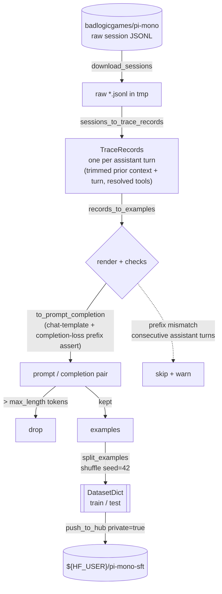

# Data — 001-pi-mono-sft

What this experiment trained on and how the dataset was built, so the data is
auditable and rebuildable.

## Source → target

| | |
| --- | --- |
| **Source** | [`badlogicgames/pi-mono`](https://huggingface.co/datasets/badlogicgames/pi-mono) — raw coding-agent session traces (per-session JSONL event logs; see upstream for license/terms) |
| **Target** | `${HF_USER}/pi-mono-sft` — **private**, `{prompt, completion}` SFT pairs |
| **Config** | source [`configs/data/pi_mono_raw.yaml`](../../configs/data/pi_mono_raw.yaml) → trainable [`configs/data/pi_mono_sft.yaml`](../../configs/data/pi_mono_sft.yaml) |
| **Prep** | [`scripts/python/prep-pi-mono-sft.py`](../../scripts/python/prep-pi-mono-sft.py) (run once, local) over [`src/data/pi_mono.py`](../../src/data/pi_mono.py) |

## Pipeline



## Format

One row per accepted assistant turn:

| column | meaning |
| --- | --- |
| `prompt` | trimmed prior conversation (≤ 18 messages) rendered in gemma's chat template, up to the assistant turn |
| `completion` | that assistant turn (text + tool calls) |
| `task_id` | source session file stem (provenance) |

Loss is **completion-only** (`completion_only_loss: true` in the trainer): the
prompt tokens are masked, so the model is graded only on producing the assistant
turn. `to_prompt_completion` asserts `full.startswith(prompt)` at build time so
that masking boundary is exact — the one guarantee the whole SFT rests on.

## Stats (this build)

- **15,256** trace records (one per visible assistant turn with a preceding user message).
- **~5** skipped at render — chat-template prefix mismatch on template edges (consecutive assistant turns). The converter skips-with-warning, never aborts a bulk run.
- remainder over **4,096** tokens (`prompt + completion`) dropped.
- **5,302** kept → **5,046 train / 256 test** (`eval_size: 256`, deterministic shuffle `seed=42`).

Reference (burtenshaw) trained on a larger converted split (6,471 / 256) — the
smaller count here is the length filter plus conversion differences, and is the
honest reason our eval loss (0.688) sits above the reference's 0.55.

## Key prep knobs

| knob | value | why |
| --- | --- | --- |
| `include_reasoning` | `false` | train on visible turns only, not hidden reasoning |
| `max_length` | `4096` | over-length pairs dropped, not truncated (truncation would sever the tool call being learned) |
| `max_context_messages` | `18` | cap prior-turn context so prompts stay in budget |
| `per_turn_clip_chars` | `12000` | clip pathologically long single turns |
| `eval_size` | `256` | held-out test split |
| `seed` | `42` | reproducible shuffle/split |

## Reproduce

```bash
# once, local — needs HF_TOKEN + HF_USER in .env; pushes the PRIVATE dataset:
uv run python scripts/python/prep-pi-mono-sft.py

# inspect the plan without pushing:
uv run python scripts/python/prep-pi-mono-sft.py dry_run=true
```

Privacy: the target is created **private** (`private: true`); the source is
third-party data — respect its upstream terms before any republication.
