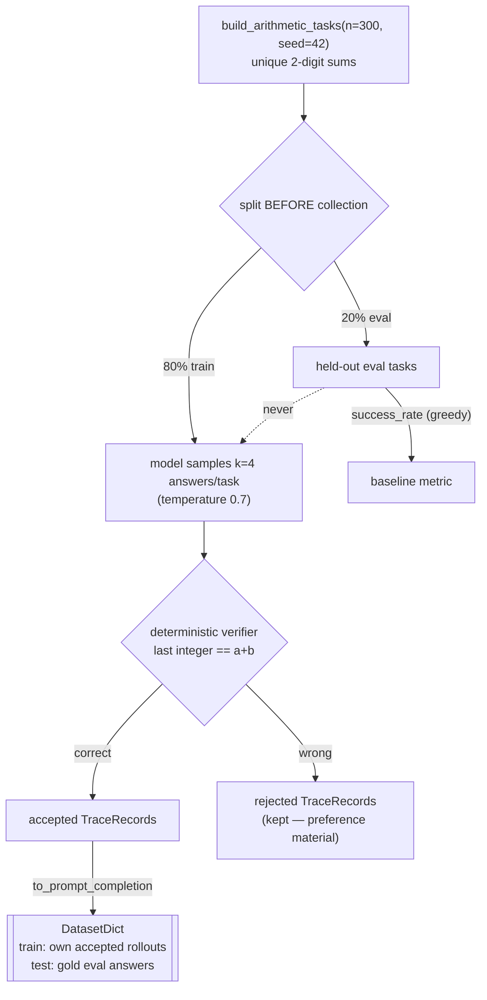

# Data — 004-self-distill

What this experiment trains on and how it was built. Unusual for this repo:
the training data is **generated by the model being trained** — provenance is
the loop, not an upstream dataset.

## Source → target

| | |
| --- | --- |
| **Source** | the model itself: `HuggingFaceTB/SmolLM2-360M-Instruct` rollouts on a synthetic 2-digit-addition task pool (`data.self_distill.build_arithmetic_tasks`, seed 42, unique (a,b) pairs, split assigned before collection) |
| **Target** | local DatasetDict at `experiments/004-self-distill/data/` (gitignored) — train = verifier-accepted own rollouts, test = gold answers on held-out eval tasks |
| **Traces** | `experiments/004-self-distill/traces/rollouts.jsonl` (gitignored) — every rollout kept, accepted AND rejected, with `verifier_output` per record |
| **Prep** | [`scripts/python/prep-self-distill.py`](../../scripts/python/prep-self-distill.py) over [`src/data/self_distill.py`](../../src/data/self_distill.py) |

## Pipeline



## Format

| split | column | meaning |
| --- | --- | --- |
| train | `prompt` | chat-templated task question (up to the assistant turn) |
| train | `completion` | the model's OWN verified answer text |
| test | `prompt` | chat-templated held-out question |
| test | `completion` | the GOLD answer (loss proxy only — the claim metric is the verifier success rate) |

Loss is completion-only. Contamination guard: eval tasks never reach
`collect_rollouts` (it raises on any eval-split task).

## Stats (filled by the collect run)

The prep run prints `SELF_DISTILL_PREP | traces=N | accepted=M | baseline_success=R`
— record those numbers here when collection runs at full scale.

## Key prep knobs

| knob | value | why |
| --- | --- | --- |
| `n_tasks` / `eval_fraction` | 300 / 0.2 | 240 train / 60 held-out eval tasks |
| `k_samples` | 4 | rejection sampling needs multiple tries per task |
| `gen_temperature` | 0.7 | diversity so sampling finds answers greedy misses |
| `max_new_tokens` | 32 | the answer is a number; short leash |
| `seed` | 42 (global) | deterministic task pool and split |

## Reproduce

```bash
uv run python scripts/python/prep-self-distill.py                     # collect + baseline
uv run python scripts/python/prep-self-distill.py dry_run=true       # inspect without writing
uv run python scripts/python/prep-self-distill.py limit_tasks=5      # tiny smoke-scale pass
```
